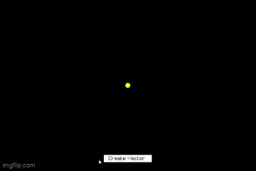
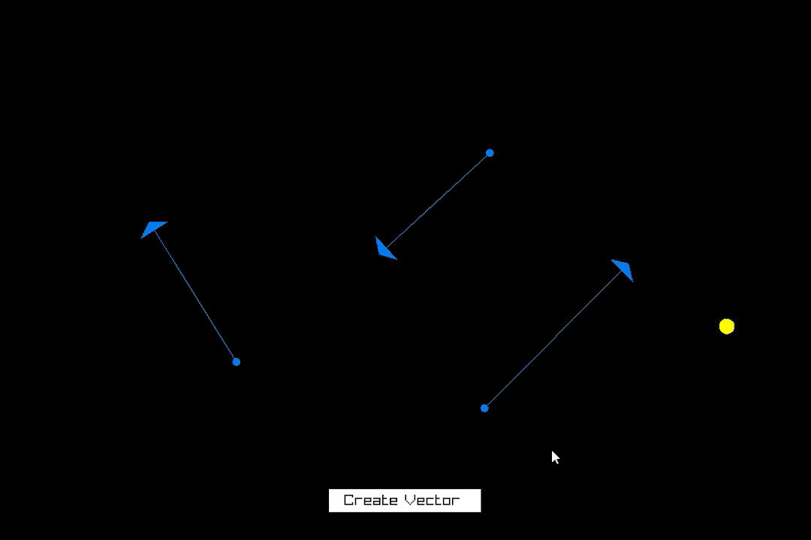

# Vector Ball Collision

This project demonstrates a simple physics simulation where vectors can be added, manipulated, and deleted. The ball collides with the screen edges and the vectors, and it can be pulled by a mouse click, moving in the opposite direction of the pull.

## Features

### Adding Vectors

You can add vectors by pressing the **Add Vector** button. The ball will be pulled in the direction of the mouse and will move in the opposite direction of the pull. It can collide with both the edges of the screen and the vectors.

### Removing Vectors

You can remove vectors by pressing on them and using the **Backspace** key.

### Vector Operations

When you press two vectors, you’ll see the following results printed in your console:

* The **sum** of the vectors.
* Their **dot product**.
* Their **coordinates**.

